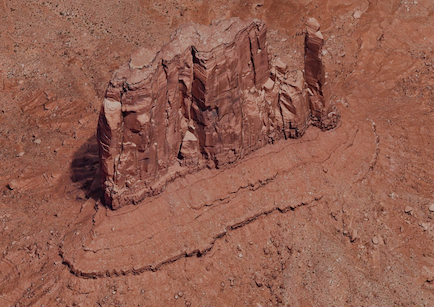
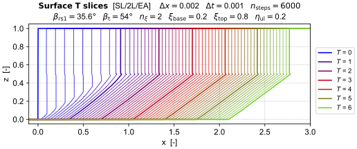

# [**The emergent geometry of rock slopes**](https://pypi.org/project/erosionfront/)

**Summary:** Simulation tools to support a geomorphic, non-convex Hamiltonian theory of rock ramp-cliff retreat and the emergent geometry of Richter-type slopes.

<!-- ### A geomorphic Hamiltonian theory of rock slope erosion -->

 <!-- and the emergent geometry of Richter-type rock slopes -->

<!-- 
 -->

<!-- {width=600} -->
<!-- 
 -->

### Abstract

An iconic image of the American West is the desert mesa: a steep cliff, rising above a ramp-like rock slope, capped by a flat bench. This famous landform has long been assumed to develop where strong rock overlies weak, and where rockfall debris suppresses ramp erosion. Such an explanation cannot be true in general, however, because the archetypal geometry can arise even in uniform bedrock with no talus armouring. Here we argue instead that it is an emergent property. Theoretical evidence comes a simple model of scarp retreat whose combined rates of weathering and surface-normal erosion are written as a slowly varying function of gradient. Model analysis and simulation, using geometric mechanics and level sets, reveal the ramp-cliff transition to form automatically as a shock solution of a non-convex Hamilton-Jacobi equation (HJE). Erodibility contrasts are not needed to explain this behaviour, but when present they help lock the landform into its classic shape and allow it to persist long-term. These conclusions are vindicated by 3D topographic analysis of differential cliff recession in geologically homogeneous material.

### Level-set solution

The purpose of the Python code presented here is to derive, analyze, and numerically solve a geomorphic Hamiltonian[^1] model of rock slope erosion and retreat[^2]. 
<!-- The code is provided as a 
[Python library package](src/erosionfront)
 and associated Jupyter notebooks (e.g., [here](notebooks/simulation/ErosionFront.ipynb) and  [here](notebooks/analysis/3DProfiling.ipynb)). -->

<!-- 
 -->

 

<!-- 
 -->

Numerical solution of the model Hamilton-Jacobi equation is achieved with a level-set scheme[^3] that employs Lax-Friedrichs finite differencing to obtain stable viscosity solutions for a non-convex Hamiltonian. The level-set code is custom implemented in Python.

Model analysis is performed using some tools from geometric mechanics[^4]: having converted the rock-slope erosion model into geomorphic Hamiltonian $\mathcal{H}(\mathbf{r}, \mathbf{p})$ form, this Hamiltonian is then used to derive Hamilton's ray tracing equations $(\partial_{\mathbf{p}}\mathcal{H}, -\partial_{\mathbf{r}}\mathcal{H})$ and the co-metric tensor $g^{ij} = \partial_{ij}\mathcal{H}$; these properties are then probed to understand model stability, notably to place bounds on the non-convexity of $\mathcal{H}$ and to identify critical angles.

### References

[^1]: [Stark, C.P., & Stark, G.J., 2022. The direction of landscape erosion. Earth Surface Dynamics, 10: 383-419.](https://doi.org/10.5194/esurf-10-383-2022)

[^2]: [Howard, A.D., & Selby, M.J., 2009. Rock Slopes. In: Parsons, A.J., Abrahams, A.D. (eds). Geomorphology of Desert Environments. Springer, Dordrecht. ](https://doi.org/10.1007/978-1-4020-5719-9_8)

[^3]: [Osher, S., & Fedkiw, R., 2003. Level Set Methods and Dynamic Implicit Surfaces. Springer-Verlag New York, Inc.](https://link.springer.com/book/10.1007/b98879)  See page 50.

[^4]: [Holm, D.D., 2011. Geometric Mechanics. Part I: Dynamics and Symmetry (2nd Edition)](https://www.ma.imperial.ac.uk/~dholm/classnotes/HolmPart1-GM.pdf)